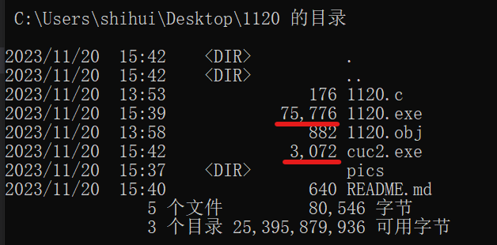

# 实验一 初探PE文件

## 一、构造`1120.exe`

1. `cl /c 1120.c` 得到.obj文件

2. 生成.exe文件，但由于`MessageBoxA`函数的代码并不在我们的源代码中，它是windows操作系统的一部分，所有系统级代码都位于库文件lib中，所以要把两个程序**链接**在一起才能成功运行。故执行`link 1120.obj user32.lib /out:1120.exe` 得到.exe文件

3. 运行`1120.exe`，弹出对话框

## 二、分析并操作.exe文件

1. 用hex editor打开.exe文件

2. 将`world`修改为`cuc`

2. `dumpbin /HEADERS 1120.exe`解构，找到程序entry point的位置

4. 缩小文件大小

`link 1120.obj User32.lib msvcrt.lib /entry:main /out:cuc2.exe` 强制指定入口函数为main

5. 在`1120.c`中修改修改`main()`为`cuc()`，重新构造为`cuc3.exe`

## 三、修改弹窗中的hello为llo

反汇编原exe文件

将68后的00修改为02

保存后运行程序，hello变为llo了

反汇编查看其地址，发现由`403000h`变为`403002h`

## 四、在二进制程序中修改MB_OKCANCEL参数

将6A后的01修改为34

然后重新运行，弹框由`确定/取消`变为`是/否`

原理：在[windows官方文档](https://learn.microsoft.com/en-us/windows/win32/api/winuser/nf-winuser-messagebox)中查找，结合老师的讲解，这里图标的显示是基于“按位或”的原理

## 五、遇到的问题和解决

在课上实验时遇到了如下问题，询问老师后解决。

1. 将`world`修改为`cuc`后，弹框中打印的字符是`cucl`，重启vscode后显示正常。
   
2. 没有强制修改入口函数也能正常执行。
   

