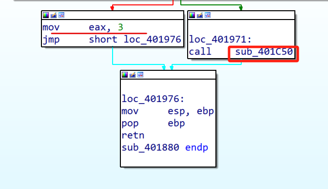
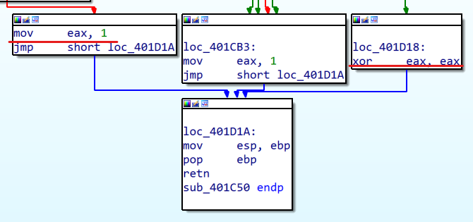
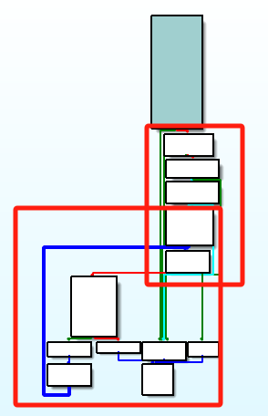
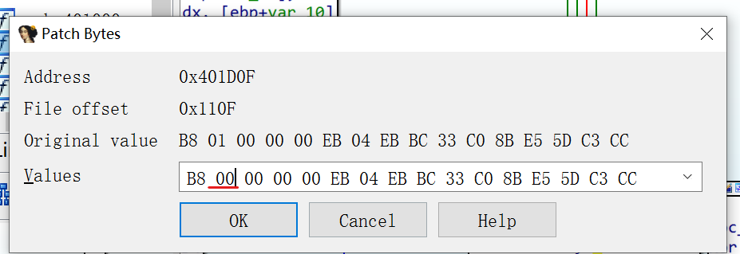
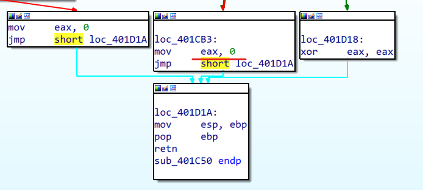
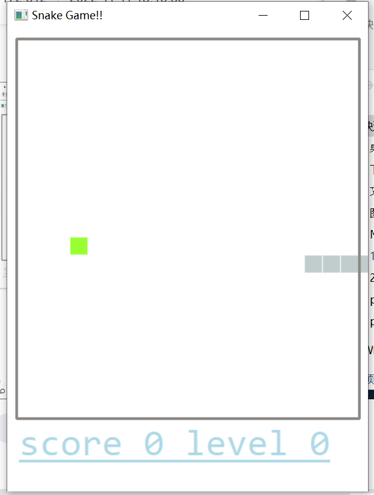
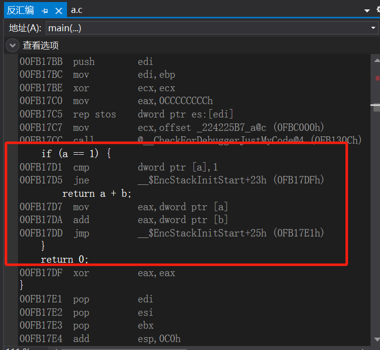

# 实验二 一个简单的游戏外挂

## 实验目的

在不修改源码的情况下，让贪吃蛇游戏不死

已知：在gameover以后，会弹出对话框（MessageBox实现）

## 实验过程

1. 用IDA对`game_operation.exe`进行反汇编，在import表中找到`MessageBox`函数，查看其调用关系

2. 外挂的关键在于这个函数

3. 点进这个函数查看其详细信息，找到出口处。我们想的是eax为1时的情况，但左侧是将3赋值给eax，显然不符合我们的要求，所以右边调用的函数的返回值应该是符合我们要求的1

4. 查看这个函数的详细情况，找到其返回值部分。可以看到一种情况下返回值为1，一种情况下返回值为0

且观察这个函数的结构，可以看到四个判断体和一个循环，很像贪吃蛇游戏中四面撞墙和撞到自身的判断逻辑，所以推测我们要改的就是这个函数

5. 在`edit`->`patch program`->`change byte`中将下划线处的`01`改为`00`(从后往前读)

这里的返回值也要从1改为0

6. 点击`edit`->`patch program`->`apply patches to input file`，保存文件

7. 实验成功，贪吃蛇碰到边界也不会死

## 穿插实验：探究几个跳转指令的含义

2. 对照视频，编写a.c，进行反汇编

结论1：if语句对应汇编中的cmp+jcc指令

结论2：eax寄存器在函数返回时保存函数的返回值

## 补充知识

一、push指令和esp

ESP = 005FF7F0

ESP = 005FF7EC

每次push都会减小4

二、绝大多数函数的开始的几条指令都是：

push ebp 将ebp寄存器值入栈

mov ebp, esp 将esp寄存器的值赋值给ebp

三、函数调用前，会将参数通过push指令入栈

四、在函数中，都是使用ebp+x来访问参数，使用ebp-x来访问局部变量

思考题：栈在函数调用、函数的参数和局部变量的使用中起到什么作用

 